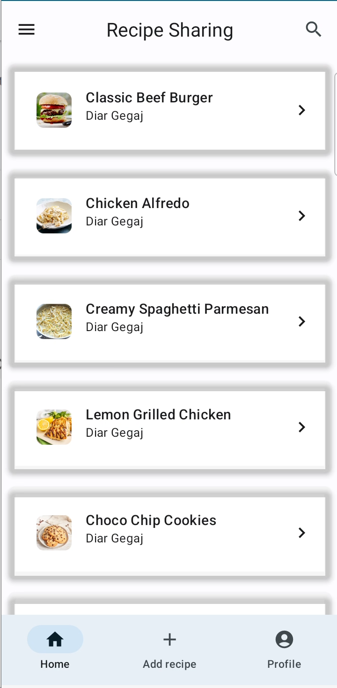
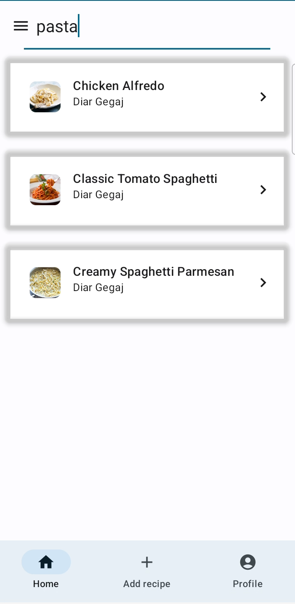
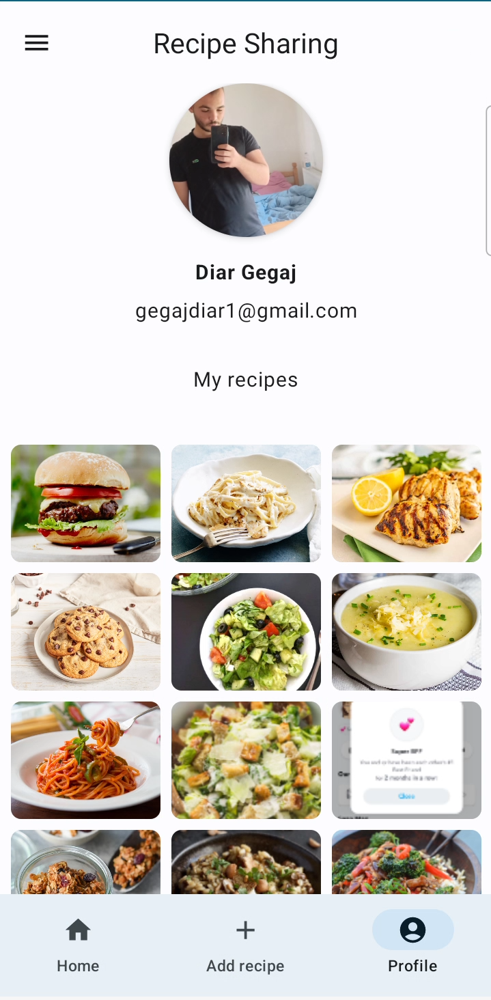
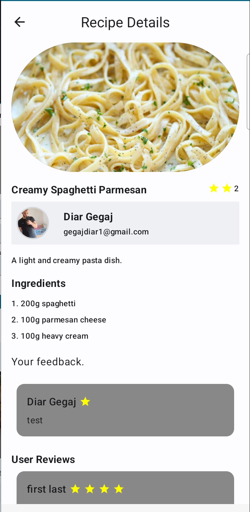
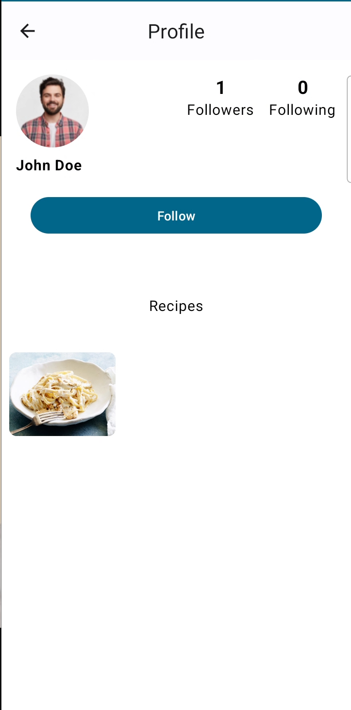
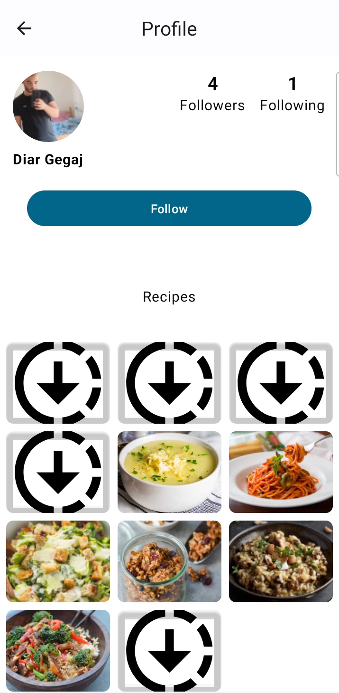
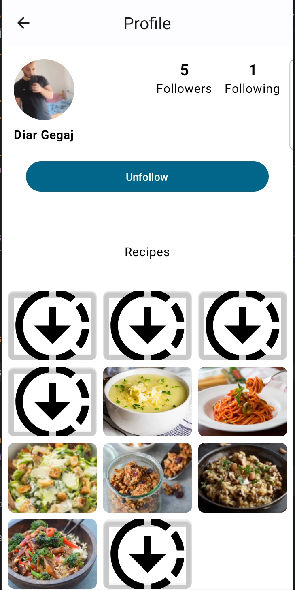

# Recipe Sharing App

Recipe Sharing is an Android app that allows users to post and share their favorite recipes. It showcases modern Android application architecture and follows best practices.

## 📸 Screenshot of the App

<div align="center">
  
  
  
  
  
  
  
  
  
  
  
  
  
</div>

## 🚀 Features

- **User Authentication**: Sign in, register and manage your account.
- **Social Interactions**:
    - **Follow & Unfollow Users**: Engage with other users by following them and manage your own followers.
- **Post and Edit Recipes**: Share your culinary wisdom.
- **Search and View**: Discover recipes posted by other users.
- **Detailed Recipe Information**: Includes ingredients, steps, and author info.
- **Profile Management**: Update your user information and profile picture.

## 🛠 Architecture & Libraries

This app is built using the MVVM architecture and incorporates the following libraries & tools:

- **Kotlin Coroutines**: For asynchronous tasks and more.
- **Firebase**: Handles user authentication, Firestore for database needs, and Firebase Storage for storing images.
- **Room**: Acts as a local cache for offline access.
- **Dagger Hilt**: Dependency injection made easy.
- **Compose**: The modern Android UI toolkit for crafting beautiful UIs.

## 💡 Getting Started

1. **Clone the Repository**

```bash
git clone https://github.com/diargegaj/RecipeSharingApp.git
```

2. **Open in Android Studio**: 
   - Once cloned, open the project in Android Studio.

3. **Setup Firebase**:
   - Navigate to the [Firebase Console](https://console.firebase.google.com/) and create a new project.
   - Add an Android app to your project.
   - Follow the setup instructions, and ensure you place `google-services.json` into your app directory.

4. **Build and Run**:
   - After setting up Firebase, you can build and run the app on an emulator or an actual device.
